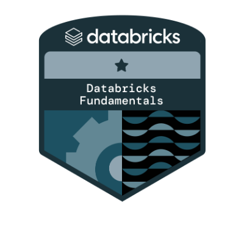

<h1 align="center">Hi , I'm Mohammed Ismail Shaikh</h1>

  With over 4 years of hands-on experience, I specialize in crafting clean, reliable data pipelines that help businesses unlock the true value of their data. I work extensively with cloud platforms and tools like Azure Data Factory, Databricks, Azure Synapse Analytics, and Delta Lake to build modern data solutions. Certified by both Databricks and Microsoft, I’m committed to continuous learning and staying ahead in this fast-evolving field. At the core, I’m driven by curiosity and the desire to solve complex data challenges in simple, effective ways.

  
 

-  I’m a **Data Engineer**

-  All of my projects are available at [my repositories](https://github.com/ismailshaikh8?tab=repositories)

-  Ask me about **Data Engineering**

-  How to reach me? [Email Me](shaikhmohammedismail08@gmail.com) / [Connect with me on LinkedIn](https://linkedin.com/in/ismail804)
 
<h3 align="center">Certifications:</h3>

  
  

<h3 align="center">Languages and Tools:</h3>

  
  
  
  
  
  
  
  
  
  
  
  
  
  

